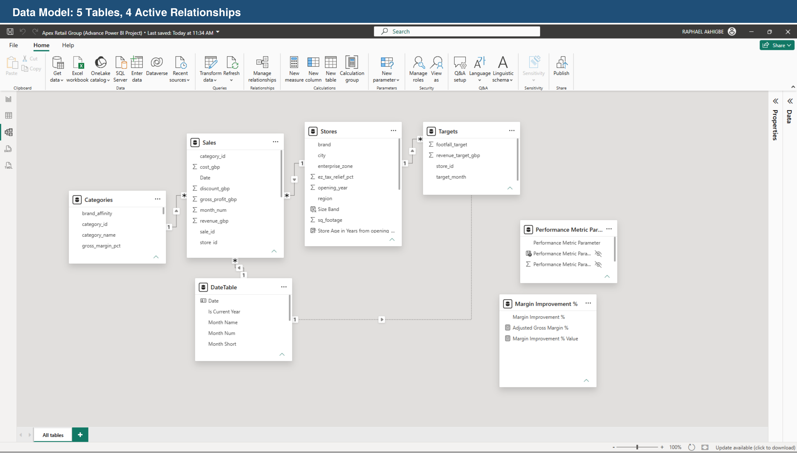
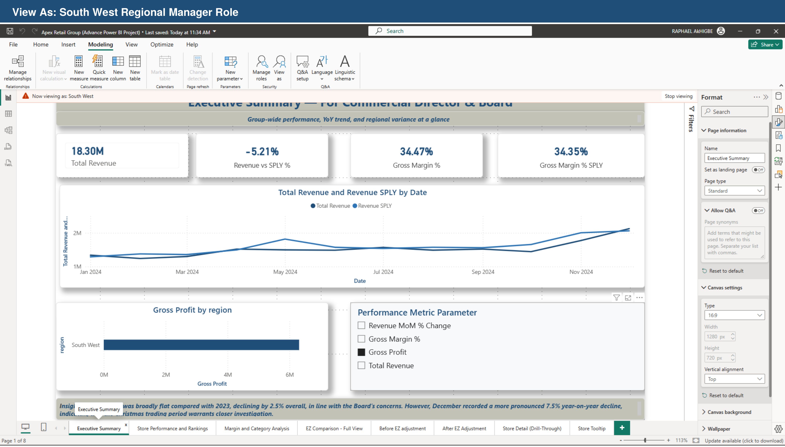
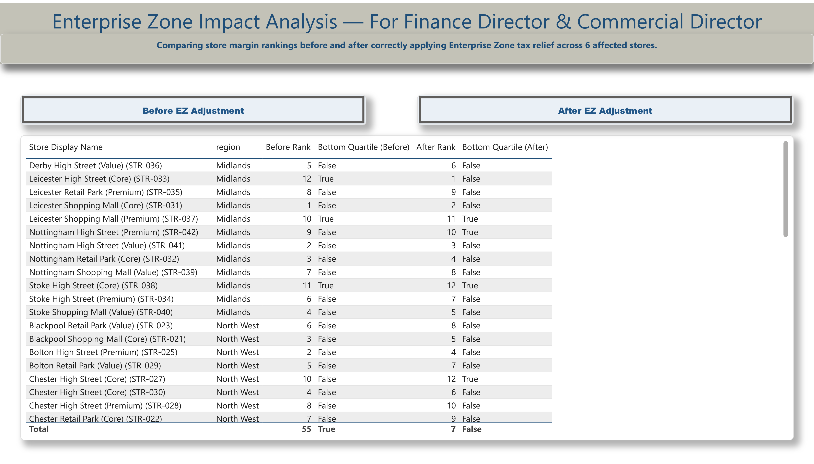
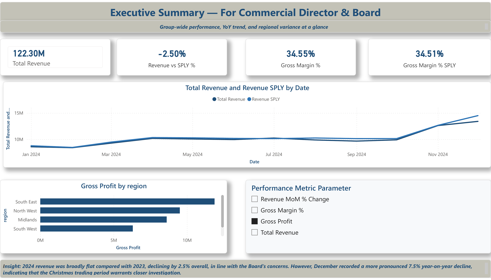
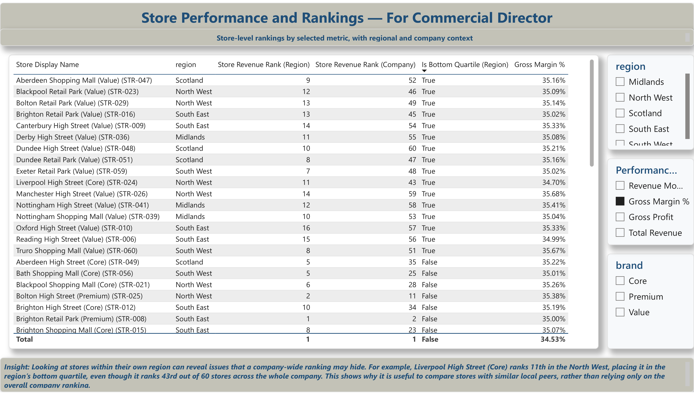
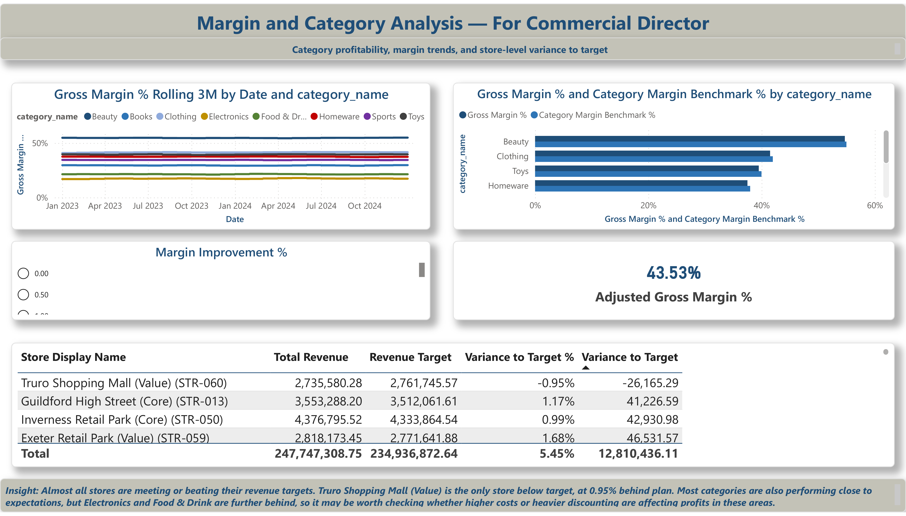

# Apex Retail Group: Advanced Power BI Analysis

An end-to-end Power BI project built around a simulated UK multi-brand retailer (60 stores, 5 regions, 3 brands: Value, Core and Premium), covering data modelling, advanced DAX, dynamic report design, row-level security, and a scenario-modelling what-if tool.

## The business problem

Apex's Commercial Director had a flat headline number, revenue down 2.5% year on year, and no way to tell whether that was evenly spread or hiding sharper regional problems. Underneath the flat annual figure, December alone was down 7.5% year on year, and several stores were underperforming within their own region despite looking unremarkable in a company-wide ranking. The brief was to build a report that gives each stakeholder, the Commercial Director, the CFO, the Head of Merchandising and the Regional Managers, the right lens on the same data rather than one generic view for everyone.

## Data model

A star schema with 5 tables and 4 active relationships: a Sales fact table, a Targets fact table, and Stores, Categories and Date dimension tables.



## Key technical decisions

**Region-scoped ranking, not company-wide.** Store rank measures use `RANKX` with `ALLEXCEPT(Stores, Stores[region])` rather than `ALL`, so a store is ranked against its regional peers, not the whole company. This surfaced stores that looked mid-table nationally but were structurally underperforming inside their own region, which is the definition the Commercial Director actually needed for closure decisions.

```dax
Store Margin Rank (Region) =
RANKX(
    ALLEXCEPT(Stores, Stores[region]),
    [Gross Margin %],
    ,
    DESC
)
```

**A duplicate-store-name bug that was silently blending data.** The raw data had four pairs of stores sharing the same name, e.g. two different stores both called "Chester High Street (Core)". Any visual grouped by `store_name` alone was quietly merging their figures into a single row. Fixed with a `Store Display Name` calculated column (`store_name` + `store_id`) used everywhere stores are grouped, ranked or drilled through, and stress-tested via drill-through to confirm the two Chester stores now isolate correctly.

**A scale-mismatch bug on a category benchmark chart.** A raw dimension column, `Categories[gross_margin_pct]`, was stored as a whole number (55 meaning 55%) rather than a true decimal, while the corresponding DAX measure returned a real decimal (0.55). Plotting them on the same chart produced a broken axis running to several thousand percent. Fixed with a wrapper measure:

```dax
Category Margin Benchmark % = DIVIDE( AVERAGE( Categories[gross_margin_pct] ), 100 )
```

**Row-level security, tested, not assumed.** Six roles: one per region plus a Commercial Director role with no filter. Verified with View As that each regional role returns only that region's totals, and that the Commercial Director role's total matches the independently verified company-wide figure.


*View As South West: every KPI, chart and table on the page re-filters to that region alone — no separate report needed per stakeholder.*

**Enterprise Zone impact analysis.** Six stores sit in government-designated Enterprise Zones with cost relief the original margin calculation didn't account for. Before adjustment, all six looked like bottom-quartile performers; after correctly applying their relief, every one of them clears the bottom-quartile flag, several jumping to the top of their region. Built as three linked report pages (Full View, Before, After) rather than a single bookmarked page, after bookmarks proved unreliable for a three-state comparison swapping a shared table's field wells; a documented, deliberate trade-off, not an oversight.


*Before the fix, 55 store-region-quarters were flagged bottom-quartile; after correctly applying EZ relief, that drops to 7.*

## Report pages

- **Executive Summary**, for the Commercial Director and Board: KPI cards, YoY trend, a fully dynamic regional chart driven by a field parameter (Revenue, Gross Profit, Gross Margin %, Revenue MoM % Change).
- **Store Performance and Rankings**: dynamic field-parameter table, region and brand slicers, drill-through to store detail.
- **Margin and Category Analysis**: rolling 3-month gross margin by category, margin vs. category benchmark, a what-if margin improvement slicer, and a revenue-vs-target variance table.
- **EZ Comparison, Full View / Before / After**: the Enterprise Zone impact comparison described above.
- **Store Detail (drill-through)** and **Store Tooltip**: per-store detail with the duplicate-name fix applied.





## Dataset

Simulated data for a fictional UK multi-brand retailer, generated for this project: 60 stores across 5 regions and 3 brand tiers, ~2 years of daily sales, monthly targets, and category benchmarks.

| File | Rows | Contents |
|---|---|---|
| `data/apex_sales.csv` | 11,520 | Sales records: revenue, cost, discount, gross profit by store and category |
| `data/apex_stores.csv` | 60 | Store attributes: region, brand, size band, Enterprise Zone status, opening year |
| `data/apex_targets.csv` | 1,440 | Monthly revenue and footfall targets by store |
| `data/apex_categories.csv` | 8 | Category names and margin benchmarks |

## What this project demonstrates

- Star-schema data modelling and relationship management
- Advanced DAX: `VAR`/`RETURN`, `RANKX`, `ALLEXCEPT`, `DATESINPERIOD`, `DIVIDE`, time intelligence
- Field parameters and what-if parameters for dynamic, scenario-driven reporting
- Row-level security design and verification, not just configuration
- Debugging real data-quality issues (duplicate keys, scale mismatches) rather than working around them
- Designing for named stakeholders instead of one generic dashboard

## Contents of this repo

- `/screenshots` — report pages, the data model, and RLS verification (View As)
- `/dax` — key measures referenced above
- `/data` — the source CSVs described above
- `Apex_Retail_Group.pbix` — the full Power BI report

---
Built by Raphael Ehis Akhigbe.
